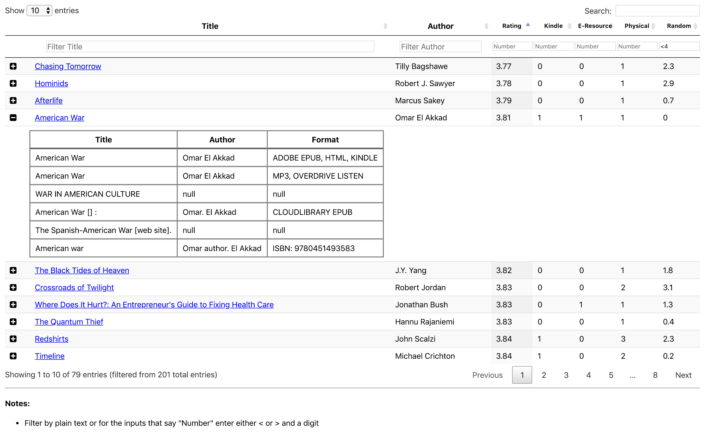

# Goodreads Library Availability

> Check book availability at the Montgomery County Public Library

1. The app queries the Goodreads API for the authorized user's `To-Read` shelf, creating a CSV file
2. The app then checks each book for availability in the Montgomery Public library digital catalog, creating a JSONL file
3. The resulting JSONL file can then be viewed in a web browser to see which books are available:

(Note: still in progress on improving the filtering of library matches and HTML parsing)

Initially I wanted to use the Overdrive API, but they don't provide access for personal projects. This tool could likely be generalized for other public libraries with minor modifications to `gr_lib_sync.moco.searchLib()` and with a custom base url similar to `gr_lib_sync.moco.mocoUrl`

## Quick Start

If you have Python ^3.6 and the required packages from `poetry.toml` (`rauth`, `beautifulsoup4`, etc.). You can run this app with `python main.py`

The more reliable way is to install Poetry ([https://github.com/sdispater/poetry](https://github.com/sdispater/poetry#installation)). Then run `poetry install` and `poetry run python main.py`.

## Testing

With `poetry` installed, run `poetry shell` then `pytest` (or `pytest -l -x`, etc.).
